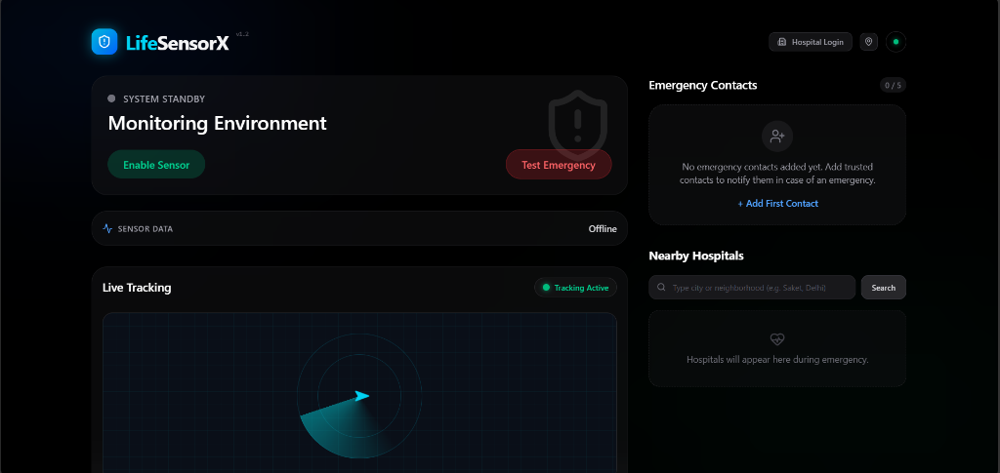
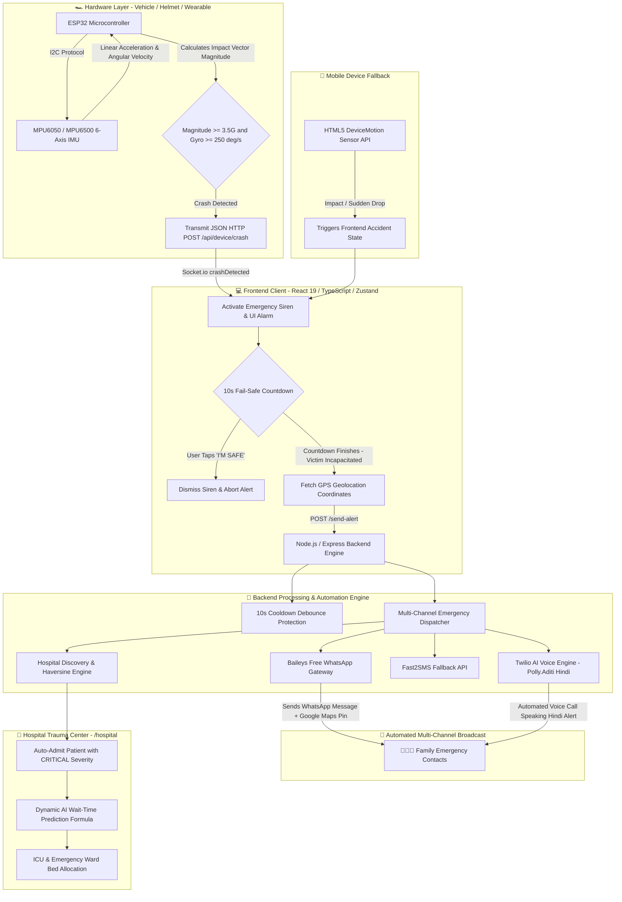

# 🚨 LifeSensorX — IoT Accident Detection & Smart Emergency Responder

[](https://react.dev)
[](https://www.typescriptlang.org)
[](https://vite.dev)
[](https://tailwindcss.com)
[](https://nodejs.org)
[](https://socket.io)
[](https://whatsapp.com)
[](https://twilio.com)

---

## 📖 Overview & Mission

**LifeSensorX** is an intelligent, real-time IoT accident detection and emergency response ecosystem. It bridges the critical "Golden Hour" gap following vehicular accidents by detecting crashes instantly via wearable/vehicle sensors, filtering false positives with a 10-second fail-safe countdown, automatically dispatching high-precision GPS emergency alerts (WhatsApp & AI Voice Calls), and pre-triaging victims into the nearest trauma hospital's live emergency queue.

---

## 🖥️ Live Application Dashboard Preview

Here is the actual interface of the **LifeSensorX** system in operation:



### 🌟 Key Dashboard Capabilities:
- **🛡️ Accident Protection Monitor:** Real-time crash monitoring engine active in browser & background.
- **📡 IoT Hardware Live Telemetry:** Active connection indicator for vehicle/helmet microcontrollers (ESP32).
- **📲 Built-in WhatsApp Gateway:** One-click modal to link WhatsApp via QR code for free automated emergency messaging.
- **📞 AI Voice Emergency Alert:** Instant voice call triggering with Hindi emergency speech synthesis.
- **🚨 10-Second Audible & Vibrational Fail-Safe:** Synthesized siren & vibration pattern with a 1-tap **"I'M SAFE"** cancellation button.
- **🏥 Smart Hospital Discovery & Live Triage:** Automatic ranking of top trauma centers and real-time admission into hospital queue.

---

## 🔄 End-to-End System Architecture



---

## ⚙️ In-Depth Technical Breakdown

### 1. 🏎️ Hardware Layer (ESP32 + MPU6050)

The vehicle or helmet is fitted with an **ESP32 microcontroller** connected to an **MPU6050 / MPU6500 6-Axis Inertial Measurement Unit (IMU)** over the I2C communication bus.

#### Pin Connection Diagram:
| MPU6050 Pin | ESP32 GPIO Pin | Description |
| :--- | :--- | :--- |
| **VCC** | 3.3V / 5V | Power Supply |
| **GND** | GND | Ground |
| **SCL** | GPIO 22 | I2C Clock Line |
| **SDA** | GPIO 21 | I2C Data Line |
| **INT** | GPIO 19 / 34 | External Interrupt (Optional) |

#### Mathematical Crash Detection Formula:
The onboard firmware samples linear acceleration ($a_x, a_y, a_z$) in $g$-force units and angular velocity ($g_x, g_y, g_z$) in degrees per second at 50Hz:

$$\text{Impact Magnitude } |\vec{A}| = \sqrt{a_x^2 + a_y^2 + a_z^2}$$

$$\text{Rotational Velocity } |\vec{\Omega}| = \sqrt{g_x^2 + g_y^2 + g_z^2}$$

A crash condition is confirmed when:
$$|\vec{A}| \ge 3.5\,g \quad \text{AND} \quad |\vec{\Omega}| \ge 250^\circ/\text{s}$$

#### ESP32 Sample Firmware (C++ / Arduino):
```cpp
#include <WiFi.h>
#include <HTTPClient.h>
#include <Adafruit_MPU6050.h>
#include <Adafruit_Sensor.h>
#include <Wire.h>

const char* ssid = "YOUR_WIFI_SSID";
const char* password = "YOUR_WIFI_PASSWORD";
const char* serverUrl = "http://YOUR_SERVER_IP:5000/api/device/crash";

Adafruit_MPU6050 mpu;

void setup() {
  Serial.begin(115200);
  WiFi.begin(ssid, password);
  while (WiFi.status() != WL_CONNECTED) { delay(500); }
  
  Wire.begin(21, 22);
  if (!mpu.begin()) { Serial.println("MPU6050 not found!"); while (1); }
  mpu.setAccelerometerRange(MPU6050_RANGE_16_G);
  mpu.setGyroRange(MPU6050_RANGE_500_DEG);
}

void loop() {
  sensors_event_t a, g, temp;
  mpu.getEvent(&a, &g, &temp);

  float ax = a.acceleration.x / 9.81;
  float ay = a.acceleration.y / 9.81;
  float az = a.acceleration.z / 9.81;
  float magnitude = sqrt(ax * ax + ay * ay + az * az);

  if (magnitude >= 3.5) {
    if (WiFi.status() == WL_CONNECTED) {
      HTTPClient http;
      http.begin(serverUrl);
      http.addHeader("Content-Type", "application/json");
      String json = "{\"deviceId\":\"ESP32_VEHICLE_01\",\"ax\":" + String(ax) +
                    ",\"ay\":" + String(ay) + ",\"az\":" + String(az) +
                    ",\"magnitude\":" + String(magnitude) + ",\"crashDetected\":true}";
      http.POST(json);
      http.end();
      delay(10000); // 10s cooldown
    }
  }
  delay(20);
}
```

---

### 2. 🚨 10-Second Intelligent Fail-Safe (Zero False Alarms)

When an impact event is received via WebSocket or browser motion sensors:
1. **Audible Siren:** Web Audio API dynamically synthesizes a dual-tone emergency siren (800 Hz & 1200 Hz square wave oscillators) without requiring external audio files.
2. **Vibrational Feedback:** Rhythmic pulse pattern `[500ms on, 200ms off]` triggered via `navigator.vibrate`.
3. **10-Second Countdown:** If the user dropped their phone or bumped a sensor, they tap the green **"I'M SAFE"** button, instantly resetting the alarm and canceling all network dispatches.

---

### 3. 📲 Free Baileys WhatsApp Gateway

LifeSensorX integrates `@whiskeysockets/baileys` directly into the Node.js backend to provide **100% free, automated WhatsApp emergency alerts** without paid third-party SMS/WhatsApp subscriptions.

- **Session Persistence:** Authenticated multi-device session credentials stored securely in `server/baileys_auth_info/`.
- **In-App QR Pairing Modal:** Users scan the QR code directly inside the LifeSensorX dashboard (`/api/whatsapp/qr`).
- **Emergency Payload:** Upon verified crash, the gateway formats and sends:
  ```text
  🚨 *EMERGENCY ALERT - LifeSensorX* 🚨

  ⚠️ An accident / crash was detected for your registered contact.
  📍 *Live Incident Location:*
  https://maps.google.com/?q=28.613939,77.209021

  🏥 Emergency medical triage and nearest trauma centers have been notified.
  ```

---

### 4. 📞 Twilio AI Voice Calling (Hindi Speech Synthesis)

For immediate high-priority alert delivery, LifeSensorX initiates an automated phone call using Twilio Voice and TwiML:
- **Speech Engine:** Amazon Polly voice `Polly.Aditi` (Indian English/Hindi neural engine).
- **TwiML Voice Prompt:**
  ```xml
  <Response>
    <Say voice="Polly.Aditi" language="hi-IN">
      सावधान! यह लाइफ सेंसर एक्स से एक आपातकालीन संदेश है। मरीज का गंभीर एक्सीडेंट डिटेक्ट हुआ है। कृपया तुरंत उनकी लोकेशन चेक करें।
    </Say>
  </Response>
  ```

---

### 5. 🏥 Smart Hospital Discovery, Haversine Distance & AI Triage

#### Haversine Great Circle Distance Formula:
Calculates exact real-world distance between the crash location $(\phi_1, \lambda_1)$ and hospital $(\phi_2, \lambda_2)$:

$$d = 2R \arcsin \left( \sqrt{\sin^2\left(\frac{\Delta \phi}{2}\right) + \cos(\phi_1)\cos(\phi_2)\sin^2\left(\frac{\Delta \lambda}{2}\right)} \right)$$

*(where $R = 6371\text{ km}$)*

#### Multi-Factor Hospital Recommendation Scoring:
Hospitals are dynamically ranked based on proximity, trauma level, bed availability, and live queue load:

$$\text{Score} = (w_1 \cdot \text{Proximity}) + (w_2 \cdot \text{ICU Bed Availability}) + (w_3 \cdot \text{Staff Ratio}) - (w_4 \cdot \text{Queue Wait Time})$$

#### Dynamic AI Wait-Time Prediction:
$$\text{Estimated Wait Time (mins)} = \left\lceil \frac{\text{Weighted Patients Ahead} \times 15}{\text{Available Emergency Doctors}} \right\rceil$$

---

## 🛠️ Complete Technology Stack

| Domain | Technology | Purpose |
| :--- | :--- | :--- |
| **Frontend Framework** | **React 19** + **TypeScript 6** | High-performance reactive UI |
| **Build Tool** | **Vite 8** | Ultra-fast HMR and bundling |
| **Styling & FX** | **Tailwind CSS 4** + **Framer Motion** | Glassmorphism, animations, dark mode |
| **State Management** | **Zustand** | Persistent client state via LocalStorage |
| **Backend Framework** | **Node.js** + **Express.js** | API gateway & telemetry routing |
| **Realtime Stream** | **Socket.io** | Bidirectional crash & hospital queue streaming |
| **WhatsApp Gateway** | **Baileys (`@whiskeysockets/baileys`)** | Free automated WhatsApp messaging |
| **Voice Calling** | **Twilio Voice API** + **TwiML (Polly.Aditi)** | Automated Hindi/English voice emergency calls |
| **Geocoding & Maps** | **Google Places API** + **OpenStreetMap** | Dynamic trauma center discovery & route links |
| **Hardware** | **ESP32** + **MPU6050/MPU6500** | 6-Axis crash detection & I2C telemetry |

---

## 🚀 Quick Start & Installation Guide

### Prerequisites
- **Node.js** (v18.x or above)
- **npm** (v9.x or above)
- **Git**

---

### Step 1: Clone the Repository
```bash
git clone https://github.com/its-Sittu/LifeSensorX.git
cd LifeSensorX
```

---

### Step 2: Install Dependencies
```bash
# 1. Install frontend dependencies
npm install

# 2. Install backend dependencies
cd server
npm install
cd ..
```

---

### Step 3: Configure Environment Variables
Inside the `server/` directory, create a `.env` file:
```env
PORT=5000
NODE_ENV=production

# Twilio AI Voice Credentials (Optional / Recommended)
TWILIO_ACCOUNT_SID=your_twilio_account_sid
TWILIO_AUTH_TOKEN=your_twilio_auth_token
TWILIO_PHONE_NUMBER=your_twilio_phone_number

# Additional Fallbacks (Optional)
FAST2SMS_API_KEY=your_fast2sms_api_key
GOOGLE_MAPS_API_KEY=your_google_maps_api_key
```

---

### Step 4: Run the Application

#### Option A: Start Both Server & Client
```bash
# Terminal 1 - Backend Server
cd server
node index.js

# Terminal 2 - Frontend Client
npm run dev
```

#### Option B: Access Ports
- **Frontend Dashboard:** `http://localhost:5173/`
- **Hospital Emergency Portal:** `http://localhost:5173/hospital`
- **Backend API & QR Dashboard:** `http://localhost:5000/api/whatsapp/qr`

---

## 📲 WhatsApp Gateway Setup (5-Second Guide)

1. Open the LifeSensorX Dashboard at `http://localhost:5173`.
2. Click **`📲 WhatsApp Gateway (Scan / Status)`** in the header (or visit `http://localhost:5000/api/whatsapp/qr`).
3. Open **WhatsApp** on your mobile phone $\to$ tap **Settings / Menu (⋮)** $\to$ **Linked Devices** $\to$ **Link a Device**.
4. Scan the QR code shown on the screen.
5. Your status will instantly turn **`CONNECTED & READY`**. All future emergency alerts will now send automatically from your WhatsApp!

---

## 📡 Complete REST API Reference

| Method | Endpoint | Description | Sample Payload / Params |
| :--- | :--- | :--- | :--- |
| `POST` | `/send-alert` | Triggers multi-channel emergency alert (WhatsApp + Voice + Hospital) | `{"contacts":["+918789812990"],"latitude":28.6139,"longitude":77.2090}` |
| `POST` | `/api/device/crash` | Receives ESP32 telemetry & broadcasts crash to clients | `{"deviceId":"ESP32_01","magnitude":4.2,"crashDetected":true}` |
| `GET` | `/api/whatsapp/qr` | Interactive web dashboard rendering live QR code | None |
| `GET` | `/api/whatsapp/status`| Returns JSON status of WhatsApp gateway | Returns `{ isConnected: true, connectedUser: "..." }` |
| `GET` | `/api/whatsapp/test` | Dispatches test WhatsApp alert to target number | `?phone=918789812990` |
| `ALL` | `/api/whatsapp/logout`| Clears session auth and generates new pairing QR | None |
| `GET` | `/api/hospitals/nearby`| Finds nearby hospitals using Places API & OSM | `?lat=28.6139&lng=77.2090&radius=10000` |
| `GET` | `/api/queue` | Returns current hospital triage queue | None |
| `POST` | `/api/queue` | Adds patient into live hospital triage list | `{"patientName":"Victim","severity":"CRITICAL"}` |

---

## 👨‍💻 Author & Acknowledgements

Developed with ❤️ by **[Sittu Kumar Singh](https://github.com/its-Sittu)**  
*LifeSensorX — Saving Lives Through Smart IoT Telematics & Rapid Emergency Response.*
